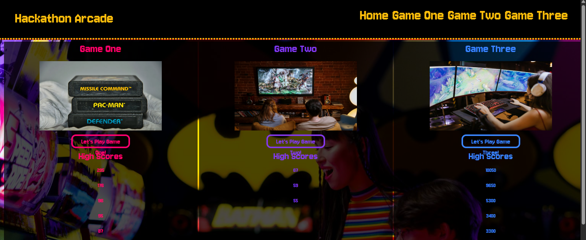
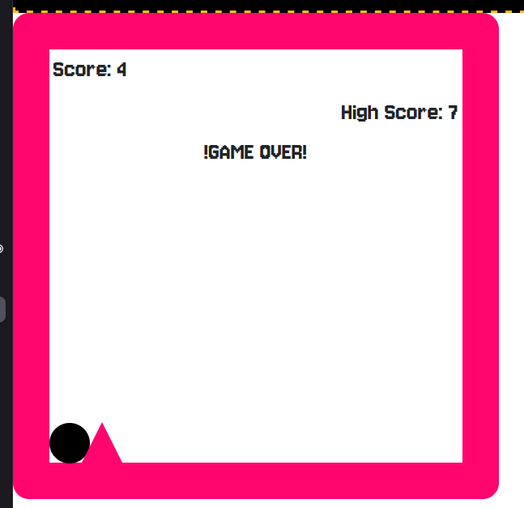
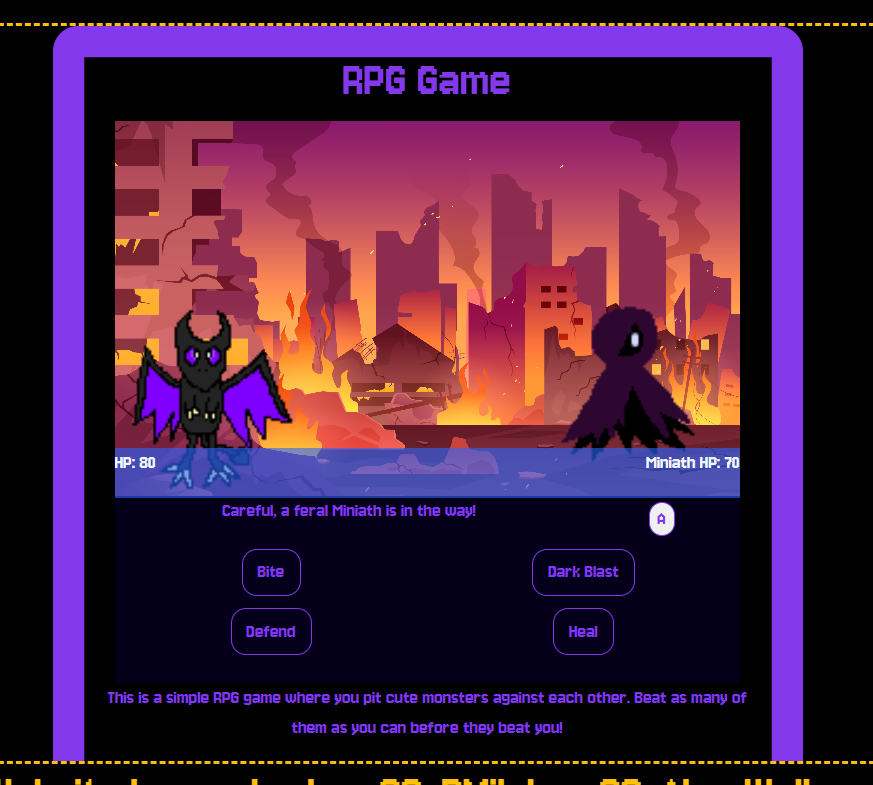
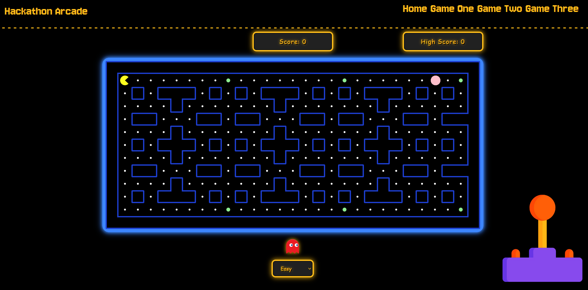

# js-hackathon-arcade

## Table of Contents

1. [About](#about)
2. [Project Goal](#project-goal)
3. [UX Design](#ux-design)
4. [Features](#features)
5. [Technology used](#technology-used)
6. [Testing](#testing)
7. [Credits](#credits)

## About

For our Hackathon project, we agreed on recreating an arcade in the form of a website, contributing our own game ideas made using JavaScript.

The live site can be found [here](https://abrawalker.github.io/js-hackathon-arcade/).

## Project Goal

The goal of this project is to create fun games with an aesthetic that capitalises on the nostalgia of arcade gaming. For this reason, we have focused on a retro motif, with a colour scheme reminiscent of the flashing lights associated with arcades. 

The website will offer a variety of games that we as developers are passionate about, with high-score tracking available for each game so that users can persevere to exceed their potential. It is important to us that this is both responsive and meets our end goal of what is essentially a miniature arcade, therefore much care has been taken into replicating the arcade experience.

Ultimately, this is a way to test our knowledge of JavaScript as well as our abilities to collaborate, working together to create a cohensive and enjoyable experience.

## UX Design

Our user stories can be found at our project board [here](https://github.com/users/AbraWalker/projects/7). 
By prioritising these stories, we could order our tasks to focus on those most vital with the notes necessary to get started on other cool potential features if desired. 

### Wireframes

Home Page:
.png)

.png)

Our wireframes were created using Balsamiq, with the colour palette replicated in the program to test that it met our expectations before committing to it. 

### Aesthetic

We decided to design the website to capture the feeling of nostalgia many of us associate with arcades, using a retro or 'old school' motif to draw on any positive memories our users may have. 

Our colour palette was selected with neon colours, tested against dark backgrounds to ensure they appeared vibrant. We chose to use a handful of colours to make up the general framework as well as picked a colour each to associate with our corresponding games. We hope through these decisions, users will find our website just as captivating as we find arcades. 

We decided on the 'Jersey 10' font from Google Fonts as our primary font due to it resembling the pixel-esque style of arcade text. The header and footer are both bordered with dashed lines in vibrant orange to compliment the theme. This also creates a more unified look when used across our three games, creating an image of cohesion even with our separate colour schemes. 

## Features

### Homepage

The homepage features links to our three games, highlighted in our respective colours. The footer is fixed so it may always be accessible. 
We have a rough highscore board on this homepage, with the planned future feature to fully integrate the input of user names so that players' efforts shall be immortalised. For now, high scores are mostly implemented in the games themselves. 

### Runner

The Runner is based on the forever fun 'Infinite Runner' genre, pushing you to forever to aim to beat your best scores with no premature ending but your own demise. It is simple but addictive, perfectly capturing the charm of this style of platformer. 

### RPG

The RPG is inspired by the monster-taming game, you play as a tamer who has made a pact with a demon called Kitsuro to fend yourselves against feral demons as you escape a burning village together. 

The interface was created with a blend of CSS and JavaScript, swapping out the images of the enemy sprites in accordance to a random number generator picking from an array. This means playthroughs can go very differently, with enemies having a variety of stats. All it takes is for one enemy to wear you down for your winning streak to end. 

Your scores for defeating each enemy vary based on how much HP you have remaining, allowing you to persevere to best your high score even with the same amount of enemies defeated. 

### Pacman + Interactive Joystick

It's the classic Pacman everyone knows add loves, complete with difficulty modes so you may forever test yourself as you chomp away and avoid getting chomped yourself! This game is complimented by an animated joystick which corresponds with every direction, even diagonal movements.

### Features for the Future

There are various features that we would like to add to our project with additional time. Accessibility in particular is something that we would prioritise, such as incorporating a toggle that is more user-friendly. This would trigger an interface with a more desaturated colour scheme to ease up on eyestrain, as well as alternative fonts which would further improve readability. 

Given more time, the RPG game would include a wider variety of enemies as well as potentially add a choice in companion monster. The story of the short campaign would be further explored, with a final adversary to face off against and additional imagery to reward players who beat the game. 

## Technology Used

- Visual Code Studio
- Balsamiq
- Slack
- Canvas
- Visual Code
- Github
- Github CoPilot

## Testing

The website passed HTML and CSS verification with no issues. 
JavaScript verification has highlighted the absence of some semicolons, as well as issues with undeclared variables in the RPG game. 

Due to corruption issues, the background for the RPG does not correctly display. The game is playable, however the burning village is not visible. 

## Credits
There are many resources we have to thank for enabling us to create games we are passionate about and allow us to expand our knowledge. Firstly, there is the valuable lessons from Code Institute, informing us of the many features of HTML, CSS and JavaScript that we have exploited. 

Other resources that have been visited and appreciated include the following:

- W3Schools, for all three languages used in this project
- Bootstrap for making the CSS just a little easier
- Pexels for various free use images, such as: 
 1. https://www.pexels.com/photo/game-cartridges-1373100/
 2. https://www.pexels.com/photo/couple-love-sitting-evening-4009604/
 3. https://www.pexels.com/photo/a-woman-playing-league-of-legends-7915357/
 4. https://www.pexels.com/photo/woman-supporting-the-man-playing-arcade-game-5767459/
 - [Prismic.io for various CSS effects](https://prismic.io/blog/css-hover-effects)
 - [Infinite Runner Tutorial](https://www.youtube.com/watch?v=OnkimGiEkb4)

